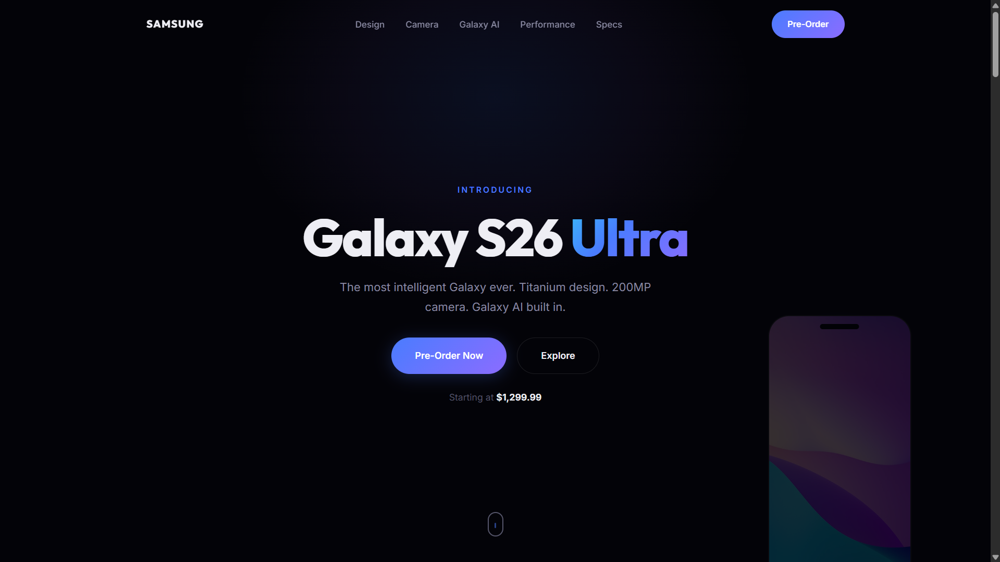

# 003 - Product Landing Page

A premium product landing page for the **Samsung Galaxy S26 Ultra**. Dark, sleek, tech-forward design inspired by Samsung's own marketing aesthetic.

## Preview



## Features

- **Cinematic hero** with gradient title, scroll mouse animation, and faded phone mockup
- **Design section** with full-bleed image, overlay specs, and interactive color picker
- **Camera showcase** with spec cards, "Shot on Galaxy" badge, and photo gallery with hover zoom
- **Galaxy AI section** with featured card layout and 6 AI capability cards
- **Performance rings** — animated SVG circular progress bars (40% faster CPU, 50% GPU, 60% NPU)
- **Battery strip** with fast charge, wireless, and capacity stats
- **Full specs table** — clean two-column layout for all hardware details
- **Pre-order CTA** with pricing, perks (free shipping, financing), and gradient glow
- **Responsive layout** with mobile nav, stacked grids, and adapted components
- **Scroll-triggered reveals** with staggered timing

## Tech Used

| Technology | Purpose |
|------------|---------|
| HTML5 | Semantic structure |
| CSS3 | Custom properties, gradients, SVG styling, grid, keyframes |
| JavaScript (ES6) | Intersection Observer, SVG ring animation, color picker, mobile nav |
| Google Fonts | Outfit + Inter |
| Font Awesome 6 | UI and feature icons |
| Unsplash | Placeholder product and camera images |

## Structure

```
003 - Product Landing Page/
├── index.html
├── css/
│   └── style.css
├── js/
│   └── script.js
└── README.md
```

## How to Run

Open `index.html` in any browser. No build tools required.

## Sections

1. **Hero** — Product name, tagline, CTA buttons, price, phone silhouette
2. **Design** — Titanium showcase, display specs overlay, color picker
3. **Camera** — 200MP specs grid, sample photo with badge, 3-image gallery
4. **Galaxy AI** — 6 feature cards (Circle to Search, Live Translate, Generative Edit, etc.)
5. **Performance** — 3 animated ring charts, battery/charging strip
6. **Specs** — Full hardware specification table
7. **Pre-Order** — Pricing, CTA, and perks (free shipping, 0% financing)
8. **Footer** — Product links, support, social, challenge credit
