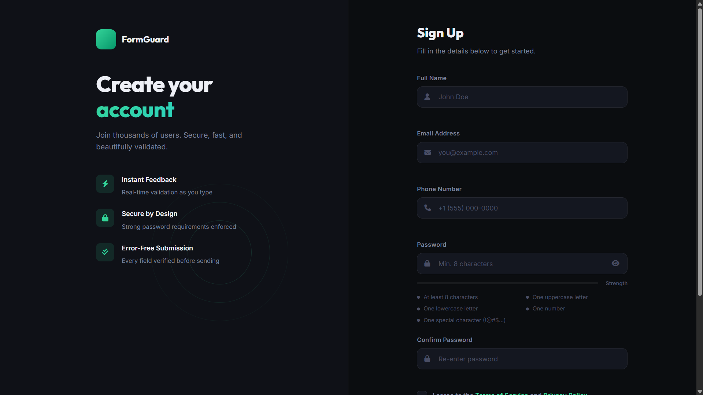

# 004 - Form Validator

A signup form with real-time validation, password strength meter, and animated success states. Dark split-screen layout with emerald green accents.

## Preview



## Features

- **Real-time validation** on every keystroke — name, email, phone, password, confirm
- **Password strength meter** with animated fill bar (Weak / Fair / Good / Strong)
- **5 password rules** with live checkmark indicators (length, upper, lower, number, special)
- **Show/hide password** toggle
- **Custom checkbox** for terms agreement
- **Visual states** — green checkmarks for valid, red X for errors, color-coded borders and glows
- **Submit flow** — loading spinner, success state, then animated modal popup
- **Form reset** after successful submission
- **Responsive** — collapses to single-column on mobile (left panel hides)

## Validation Rules

| Field | Requirements |
|-------|-------------|
| Full Name | Min 3 characters, letters/spaces/hyphens only |
| Email | Valid email format (user@domain.tld) |
| Phone | 7-15 digits (allows formatting characters) |
| Password | 8+ chars, uppercase, lowercase, number, special character |
| Confirm Password | Must match password |
| Terms | Checkbox must be checked |

## Tech Used

| Technology | Purpose |
|------------|---------|
| HTML5 | Semantic form structure, novalidate for custom validation |
| CSS3 | Custom properties, state-based styling, transitions, grid |
| JavaScript (ES6) | Real-time validation, DOM manipulation, strength scoring |
| Google Fonts | Outfit + Inter |
| Font Awesome 6 | Input icons, status icons, rule indicators |

## Structure

```
004 - Form Validator/
├── index.html
├── css/
│   └── style.css
├── js/
│   └── script.js
└── README.md
```

## How to Run

Open `index.html` in any browser. No build tools required.
