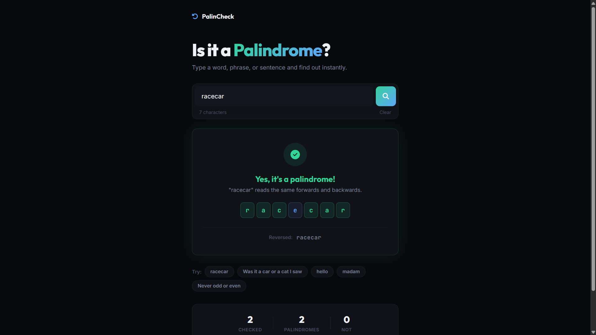

# 008 - Palindrome Checker

Type a word or phrase and instantly see if it reads the same forwards and backwards. Includes a visual letter-by-letter breakdown.

## Preview



## Features

- **Instant check** — press Enter or click the search button
- **Visual letter breakdown** — each letter rendered as a box with color coding:
  - Green = matches its mirror position
  - Red = doesn't match
  - Blue = center letter (odd-length palindromes)
- **Staggered drop animation** on each letter box
- **Reversed string display** — shows the backwards version below the breakdown
- **Ignores spaces, punctuation, and case** — "A man a plan a canal Panama" works
- **Example buttons** — click to instantly test common palindromes and non-palindromes
- **Session stats** — tracks total checked, palindromes found, and non-palindromes
- **Character counter** on the input
- **Result card** glows green (palindrome) or red (not) with icon and explanation

## Tech Used

| Technology | Purpose |
|------------|---------|
| HTML5 | Semantic structure |
| CSS3 | Custom properties, state-based glow/borders, keyframe animations |
| JavaScript (ES6) | String manipulation, DOM generation, event handling |
| Google Fonts | Outfit, Inter, JetBrains Mono |
| Font Awesome 6 | Status icons |

## Structure

```
008 - Palindrome Checker/
├── index.html
├── css/
│   └── style.css
├── js/
│   └── script.js
└── README.md
```

## How to Run

Open `index.html` in any browser. No build tools required.
