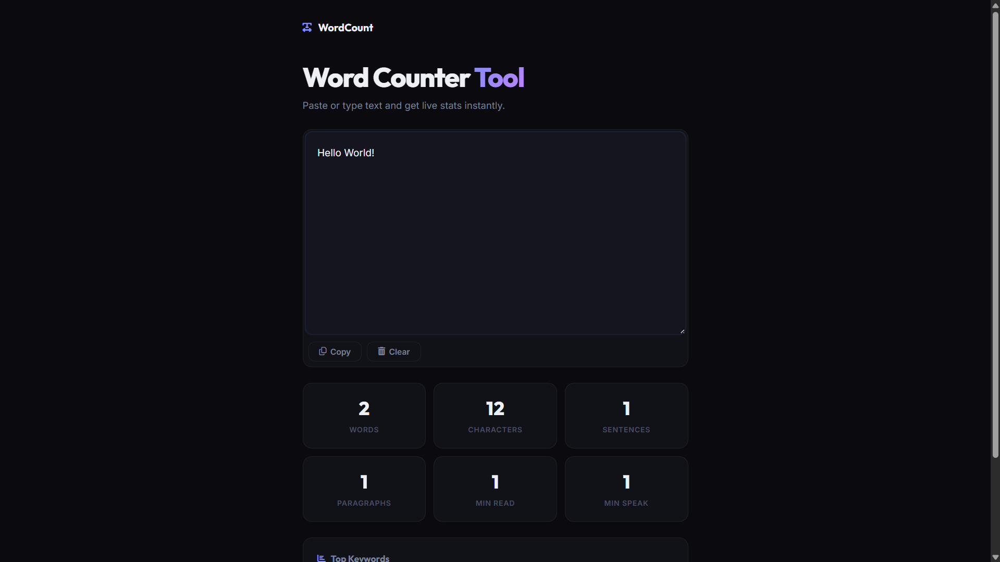

# 009 - Word Counter Tool

Live word, character, sentence, and paragraph counter with reading/speaking time estimates and keyword density analysis.

## Preview



## Features

- **Live stats** — words, characters, sentences, paragraphs update as you type
- **Reading & speaking time** estimates (200 wpm read, 130 wpm speak)
- **Keyword density** — top 8 keywords shown as bar chart (filters out stop words)
- **Copy & Clear** buttons
- **Responsive** grid layout

## Structure

```
009 - Word Counter Tool/
├── index.html
├── css/
│   └── style.css
├── js/
│   └── script.js
└── README.md
```

## How to Run

Open `index.html` in any browser. No build tools required.
