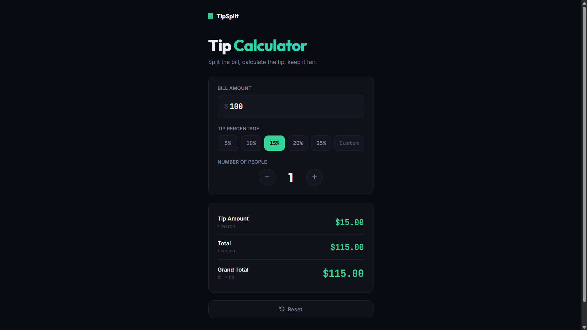

# 010 - Tip Calculator

Bill splitting tool with preset and custom tip percentages, per-person breakdown, and people counter.

## Preview



## Features

- **Preset tip buttons** — 5%, 10%, 15%, 20%, 25% with active state
- **Custom tip** input for any percentage
- **People counter** with +/- buttons
- **Live results** — tip per person, total per person, and grand total
- **Reset** button to clear everything

## Structure

```
010 - Tip Calculator/
├── index.html
├── css/
│   └── style.css
├── js/
│   └── script.js
└── README.md
```

## How to Run

Open `index.html` in any browser. No build tools required.
