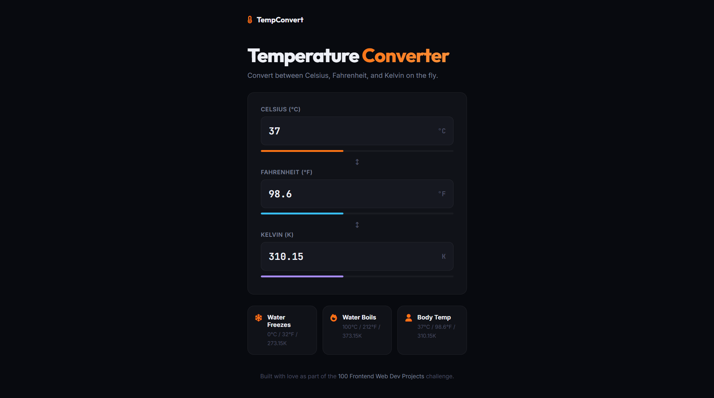

# 011 - Temperature Converter

Convert between Celsius, Fahrenheit, and Kelvin instantly. Type in any field and the others update live.

## Preview



## Features

- **Bidirectional conversion** — type in any field, the other two update
- **Color-coded progress bars** that react to the temperature value
- **Reference cards** — water freeze/boil points and body temperature
- **Clean monospace inputs** with unit labels

## Structure

```
011 - Temperature Converter/
├── index.html
├── css/
│   └── style.css
├── js/
│   └── script.js
└── README.md
```

## How to Run

Open `index.html` in any browser. No build tools required.
