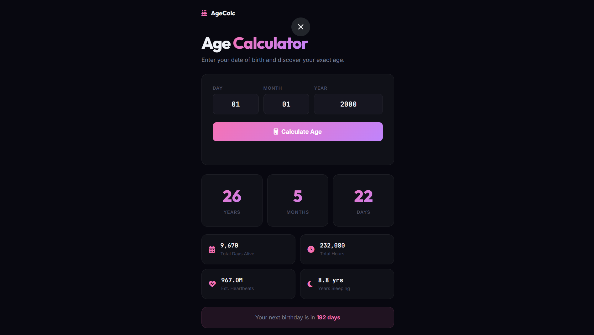

# 012 - Age Calculator

Enter your date of birth and get your exact age in years, months, and days — plus fun facts like total heartbeats and days until your next birthday.

## Preview



## Features

- **Exact age** in years, months, and days
- **Fun facts** — total days alive, total hours, estimated heartbeats, years spent sleeping
- **Next birthday countdown**
- **Input validation** with error messages
- **Animated results** slide-up on calculate

## Structure

```
012 - Age Calculator/
├── index.html
├── css/
│   └── style.css
├── js/
│   └── script.js
└── README.md
```

## How to Run

Open `index.html` in any browser. No build tools required.
