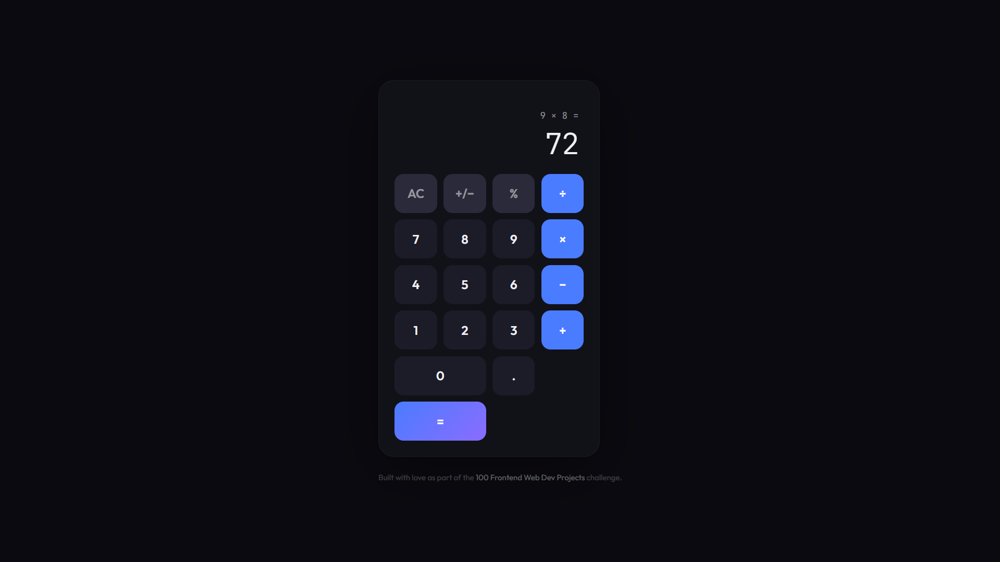

# 013 - Simple Calculator

A fully functional calculator with a clean, modern UI. Supports basic arithmetic, keyboard input, and chained operations.

## Preview



## Features

- **Basic operations** — add, subtract, multiply, divide
- **Chained calculations** — chain operations without pressing equals
- **Expression display** — shows the full expression above the result
- **Keyboard support** — numbers, operators, Enter, Escape, Backspace
- **Special functions** — AC (clear), +/− (toggle sign), % (percent)
- **Active operator highlight** with ring indicator
- **Auto-shrink** display for long numbers
- **Divide by zero** handled gracefully

## Structure

```
013 - Simple Calculator/
├── index.html
├── css/
│   └── style.css
├── js/
│   └── script.js
└── README.md
```

## How to Run

Open `index.html` in any browser. No build tools required.
