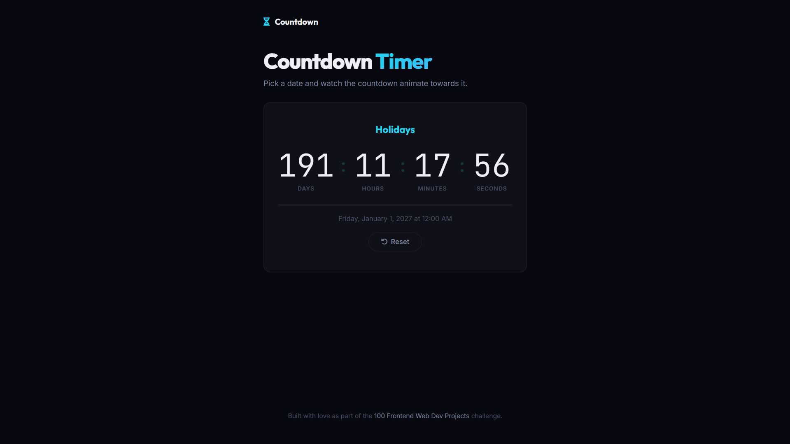

# 016 - Countdown Timer

Pick a target date and watch the countdown animate towards it with days, hours, minutes, and seconds.

## Preview



## Features

- **Custom event name and date/time** input
- **Live countdown** with days, hours, minutes, seconds
- **Progress bar** showing elapsed vs remaining time
- **Blinking separators** and monospace digits
- **"Time's Up" screen** when countdown reaches zero
- **Reset** to start a new countdown

## Structure

```
016 - Countdown Timer/
├── index.html
├── css/style.css
├── js/script.js
└── README.md
```

## How to Run

Open `index.html` in any browser.
