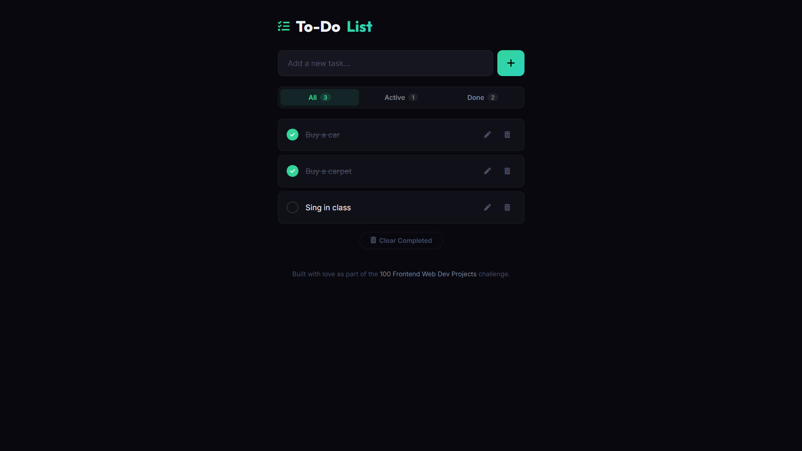

# 018 - To-Do List

Add, edit, delete, and complete tasks with filters and localStorage persistence.

## Preview



## Features

- **Add tasks** with Enter key or button
- **Mark complete** with animated checkbox
- **Inline edit** — click pen icon to edit, Enter to save
- **Delete** individual tasks
- **Filters** — All / Active / Done with count badges
- **Clear completed** button
- **LocalStorage** persistence across sessions
- **Empty state** message when no tasks

## Structure

```
018 - To-Do List/
├── index.html
├── css/style.css
├── js/script.js
└── README.md
```

## How to Run

Open `index.html` in any browser.
