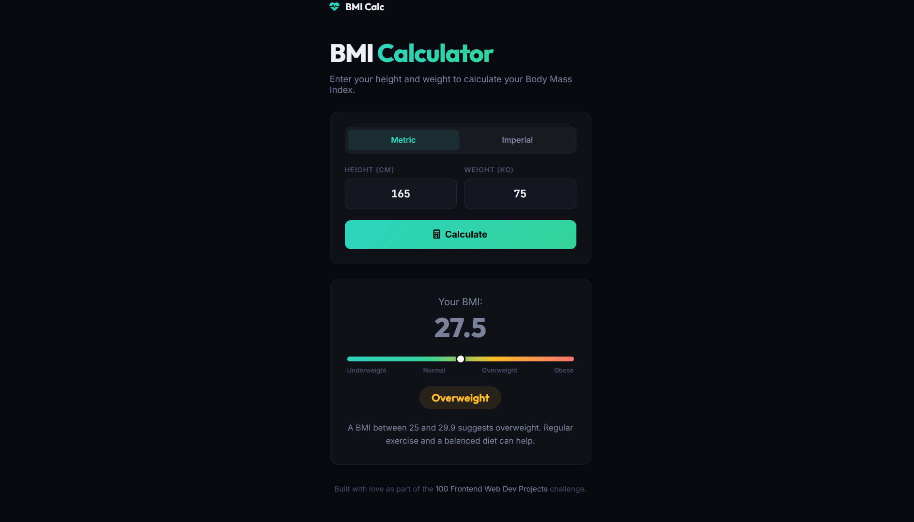

# 019 - BMI Calculator

Enter height and weight to calculate BMI with a color-coded gauge and health category.

## Preview



## Features

- **Metric & Imperial** toggle
- **Gradient gauge** with sliding marker
- **Color-coded categories** — Underweight, Normal, Overweight, Obese
- **Health info** text for each category

## Structure

```
019 - BMI Calculator/
├── index.html
├── css/style.css
├── js/script.js
└── README.md
```

## How to Run

Open `index.html` in any browser.
