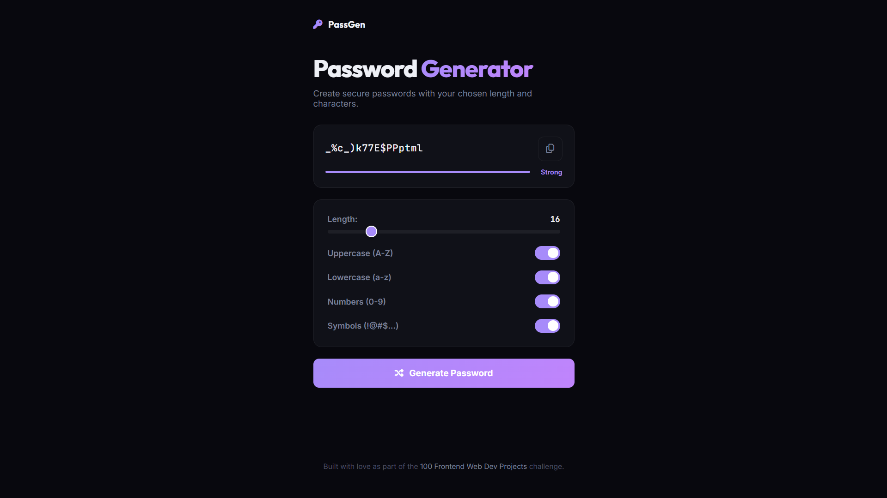

# 020 - Password Generator

Generate secure passwords with configurable length, character types, strength meter, and one-click copy.

## Preview



## Features

- **Length slider** (6-64 characters)
- **Toggle options** — uppercase, lowercase, numbers, symbols
- **Strength meter** — Weak / Fair / Good / Strong with color bar
- **Copy to clipboard** with toast notification
- **Auto-generates** on page load

## Structure

```
020 - Password Generator/
├── index.html
├── css/style.css
├── js/script.js
└── README.md
```

## How to Run

Open `index.html` in any browser.
