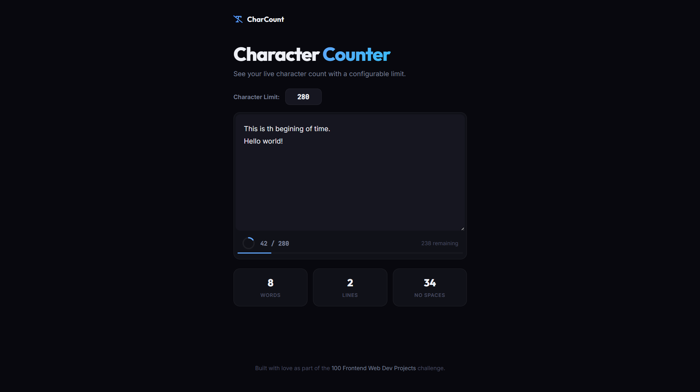

# 021 - Character Limit Counter

Live character count in a textarea with configurable limit, circular ring indicator, progress bar, and warning states.

## Preview



## Features

- **Configurable limit** — change the max character count
- **SVG ring indicator** that fills as you type
- **Progress bar** below the textarea
- **Color states** — blue (normal), amber (>85%), red (over limit)
- **Extra stats** — word count, line count, characters without spaces

## Structure

```
021 - Character Limit Counter/
├── index.html
├── css/style.css
├── js/script.js
└── README.md
```

## How to Run

Open `index.html` in any browser.
