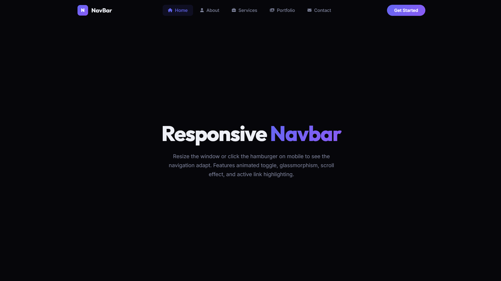

# 022 - Responsive Navbar

A responsive navigation bar with hamburger toggle, glassmorphism scroll effect, and active section tracking.

## Preview



## Features

- **Glassmorphism** background on scroll with blur effect
- **Animated hamburger** toggle (X animation)
- **Full-screen mobile overlay** with centered links
- **Active link tracking** via Intersection Observer as you scroll
- **CTA button** in the navbar
- **Icons** on each nav link

## Structure

```
022 - Responsive Navbar/
├── index.html
├── css/style.css
├── js/script.js
└── README.md
```

## How to Run

Open `index.html` in any browser.
