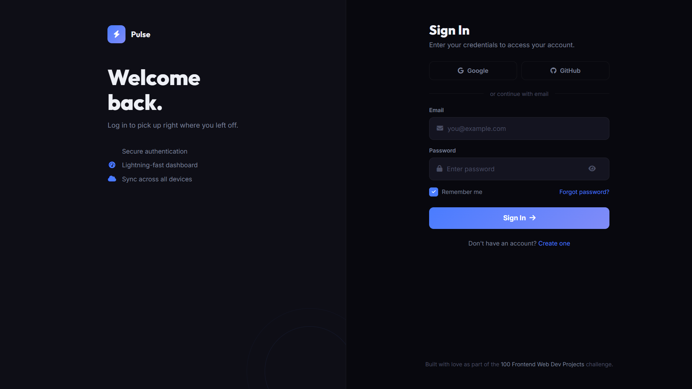

# 024 - Login Page UI

A clean, modern login interface with split-screen layout, social login buttons, and animated submit flow. Design-focused, no backend.

## Preview



## Features

- **Split-screen layout** — branded side panel + login form
- **Social login buttons** — Google and GitHub
- **Show/hide password** toggle
- **Remember me** checkbox with custom design
- **Submit animation** — spinner then success state
- **Responsive** — side panel hides on mobile

## Structure

```
024 - Login Page UI/
├── index.html
├── css/style.css
├── js/script.js
└── README.md
```

## How to Run

Open `index.html` in any browser.
