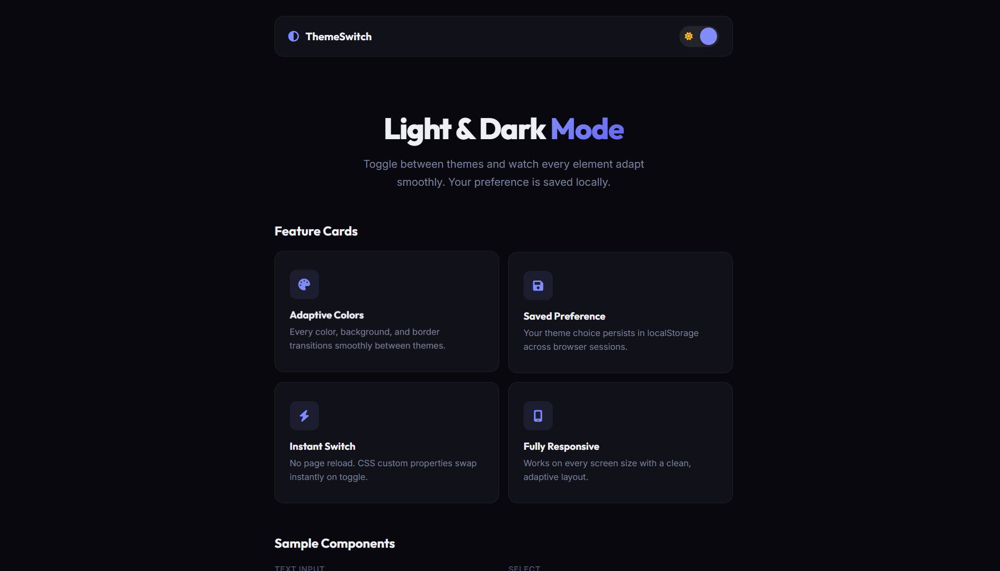

# 025 - Light / Dark Mode Toggle

Toggle between light and dark themes with a smooth animated switch. Every element adapts — cards, inputs, badges, and progress bars.

## Preview



## Features

- **Animated toggle switch** with sun/moon icons and sliding thumb
- **CSS custom properties** swap all colors instantly
- **Smooth transitions** on every element (background, text, borders)
- **LocalStorage** persists preference across sessions
- **Sample components** — cards, text inputs, select dropdown, badges, progress bar
- **Responsive** layout

## Structure

```
025 - Light Dark Mode Toggle/
├── index.html
├── css/style.css
├── js/script.js
└── README.md
```

## How to Run

Open `index.html` in any browser.
