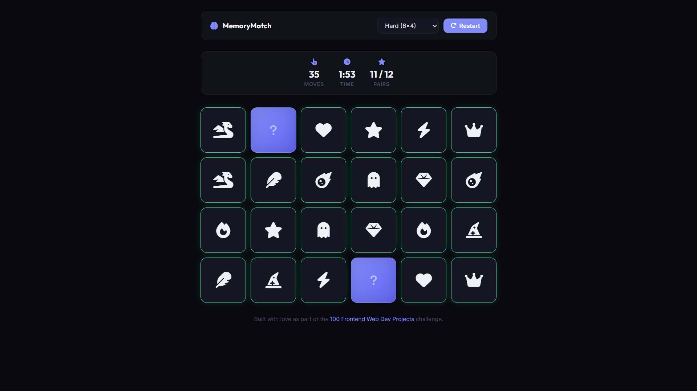

# 026 - Memory Matching Game

Flip and match card pairs in this classic recall test. Choose from three difficulty levels and try to clear the board in as few moves as possible.

## Preview



## Features

- **3D card flip animation** with perspective and smooth transitions
- **Three difficulty levels** — Easy (4x3), Medium (4x4), Hard (6x4)
- **Move counter, timer, and pair tracker** displayed in a stats bar
- **Star rating** on win based on move efficiency
- **Win modal** with stats summary and play-again option
- **Staggered entrance animation** when the board loads
- **Hover tilt effect** on unflipped cards
- **Matched cards** glow green with a pop animation
- **Responsive** layout

## Structure

```
026 - Memory Matching Game/
├── index.html
├── css/style.css
├── js/script.js
└── README.md
```

## How to Run

Open `index.html` in any browser.
