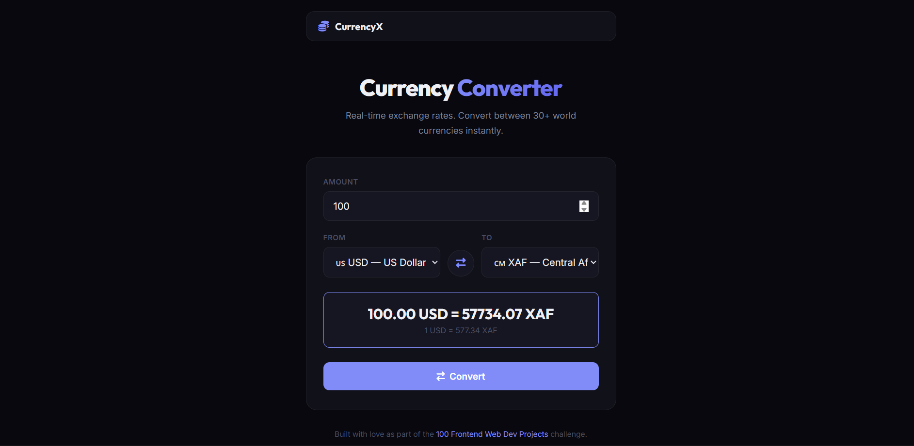

# 027 - Currency Converter

Convert between 30+ world currencies using real-time exchange rates from the Frankfurter API.

## Preview



## Features

- **Real-time rates** fetched from the Frankfurter API (no API key needed)
- **30+ currencies** including USD, EUR, GBP, JPY, NGN, XAF, and more
- **Swap button** to quickly reverse the conversion direction
- **Unit rate display** shows the per-unit exchange rate
- **Loading state** with spinner animation while fetching
- **Keyboard support** — press Enter to convert
- **Responsive** layout

## Structure

```
027 - Currency Converter/
├── index.html
├── css/style.css
├── js/script.js
└── README.md
```

## How to Run

Open `index.html` in any browser. Requires an internet connection for live rates.
