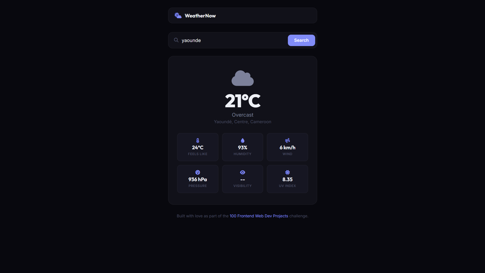

# 028 - Weather App

Search for any city and get current weather conditions including temperature, humidity, wind, and UV index.

## Preview



## Features

- **Live weather data** from the Open-Meteo API (no API key needed)
- **City search** with geocoding for worldwide coverage
- **Weather icons** that change based on current conditions
- **Six detail cards** — feels like, humidity, wind, pressure, visibility, UV index
- **Weather code mapping** for 20+ conditions (clear, rain, snow, thunderstorm, etc.)
- **Error handling** for unknown cities and network failures
- **Keyboard support** — press Enter to search
- **Responsive** layout

## Structure

```
028 - Weather App/
├── index.html
├── css/style.css
├── js/script.js
└── README.md
```

## How to Run

Open `index.html` in any browser. Requires an internet connection for live data.
