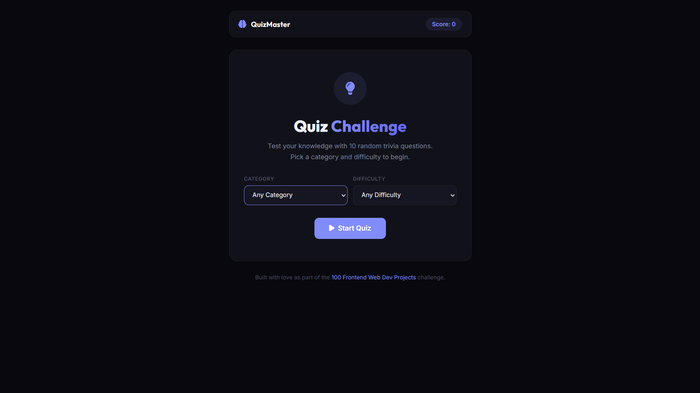

# 029 - Quiz App

Multiple-choice trivia quiz with categories, difficulty selection, a 15-second timer per question, and scoring with feedback.

## Preview



## Features

- **10 random questions** fetched from the Open Trivia Database API
- **9 category choices** — General Knowledge, Science, Computers, Sports, Geography, History, Animals, Film, Music
- **3 difficulty levels** — Easy, Medium, Hard (or any)
- **15-second countdown timer** per question with urgent animation
- **Instant feedback** — correct answers highlighted green, wrong in red
- **Progress bar** tracking completion through the quiz
- **Results screen** with percentage score, correct/wrong/skipped breakdown, and trophy tier
- **Responsive** layout

## Structure

```
029 - Quiz App/
├── index.html
├── css/style.css
├── js/script.js
└── README.md
```

## How to Run

Open `index.html` in any browser. Requires an internet connection for trivia questions.
