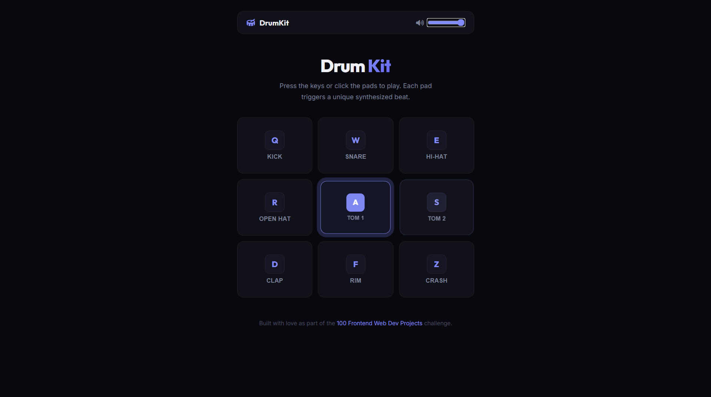

# 030 - Drum Kit App

Press keyboard keys or click the pads to play drum sounds. Each pad triggers a unique beat synthesized with the Web Audio API.

## Preview



## Features

- **9 drum pads** — Kick, Snare, Hi-Hat, Open Hat, Tom 1, Tom 2, Clap, Rim, Crash
- **Keyboard support** — mapped to Q, W, E, R, A, S, D, F, Z
- **Web Audio API synthesis** — no external sound files needed
- **Volume control** slider in the navbar
- **Visual feedback** — pads scale and glow with a ripple animation on hit
- **Responsive** grid layout

## Structure

```
030 - Drum Kit App/
├── index.html
├── css/style.css
├── js/script.js
└── README.md
```

## How to Run

Open `index.html` in any browser. No internet connection required.
