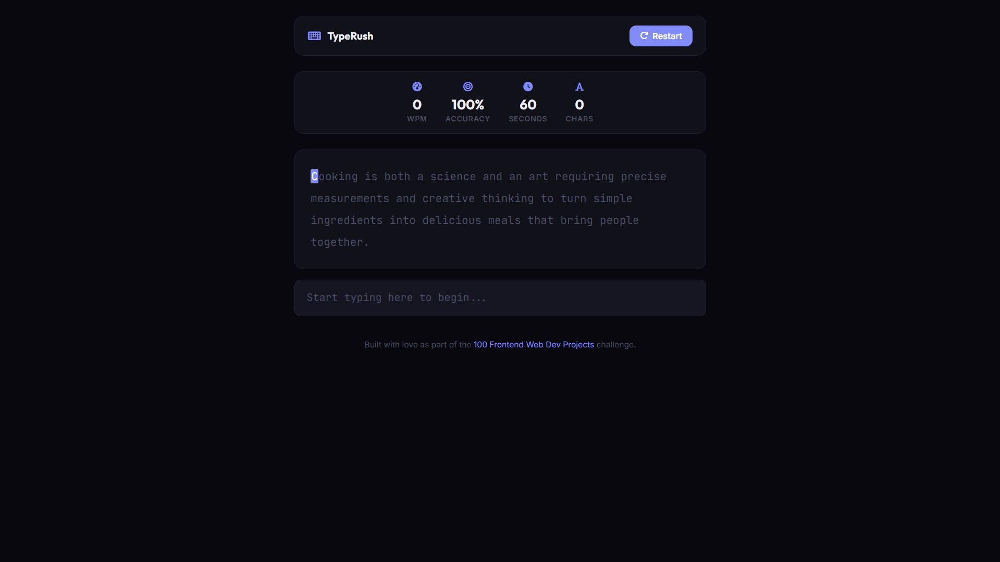

# 031 - Typing Speed Test

Test your typing speed and accuracy with a 60-second timed challenge. Characters highlight in real-time as you type.

## Preview



## Features

- **60-second timer** that starts when you begin typing
- **Live WPM calculation** updated every second
- **Accuracy tracking** with correct/incorrect character highlighting
- **Monospace text display** with color-coded characters (green = correct, red = incorrect)
- **Current character indicator** highlighted with accent color
- **Results modal** with WPM, accuracy, characters, and word count
- **10 random paragraphs** for variety on each attempt
- **Responsive** layout

## Structure

```
031 - Typing Speed Test/
├── index.html
├── css/style.css
├── js/script.js
└── README.md
```

## How to Run

Open `index.html` in any browser.
