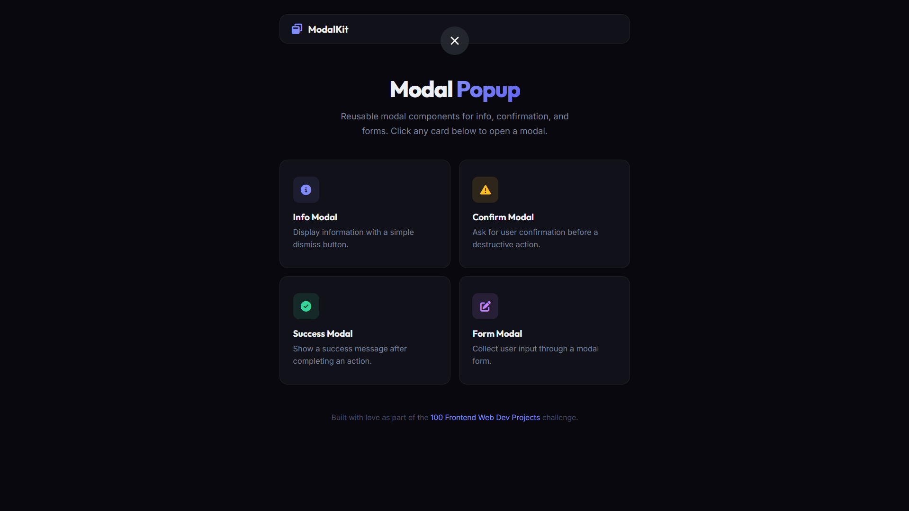

# 032 - Modal Popup

Reusable modal popup components for info messages, confirmations, success alerts, and forms.

## Preview



## Features

- **4 modal types** — Info, Confirm, Success, and Form
- **Backdrop click** to close any modal
- **Escape key** closes all open modals
- **Close button** on every modal
- **Form modal** with name, email, and message fields — submitting triggers a success modal
- **Smooth animations** — scale and translate entrance transitions
- **Color-coded icons** for each modal type (blue, amber, green, purple)
- **Responsive** layout

## Structure

```
032 - Modal Popup/
├── index.html
├── css/style.css
├── js/script.js
└── README.md
```

## How to Run

Open `index.html` in any browser.
