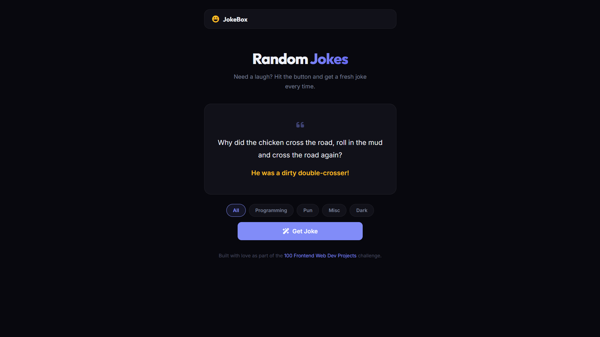

# 033 - Joke Generator

Fetch random jokes from the JokeAPI with category filtering and a punchline reveal button.

## Preview



## Features

- **Random jokes** fetched from JokeAPI v2
- **5 categories** — All, Programming, Pun, Misc, Dark
- **Two-part jokes** with a "Reveal Punchline" button for setup/delivery format
- **Single-line jokes** displayed directly
- **Loading spinner** while fetching
- **Safe mode** enabled by default
- **Responsive** layout

## Structure

```
033 - Joke Generator/
├── index.html
├── css/style.css
├── js/script.js
└── README.md
```

## How to Run

Open `index.html` in any browser. Requires an internet connection.
