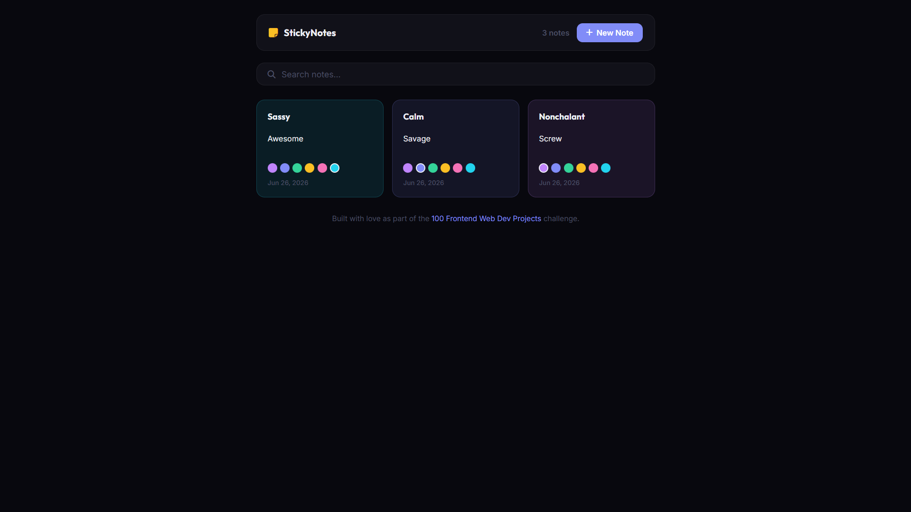

# 034 - Sticky Notes

Create, edit, color-code, and delete notes that persist in localStorage. Includes search filtering.

## Preview



## Features

- **Create notes** with title and body — auto-saved to localStorage
- **6 color themes** — purple, blue, green, amber, pink, cyan
- **Live search** to filter notes by title or content
- **Delete notes** with a smooth fade-out animation
- **Note counter** in the navbar
- **Empty state** placeholder when no notes exist
- **Date stamp** on each note
- **Responsive** masonry-style grid

## Structure

```
034 - Sticky Notes/
├── index.html
├── css/style.css
├── js/script.js
└── README.md
```

## How to Run

Open `index.html` in any browser.
