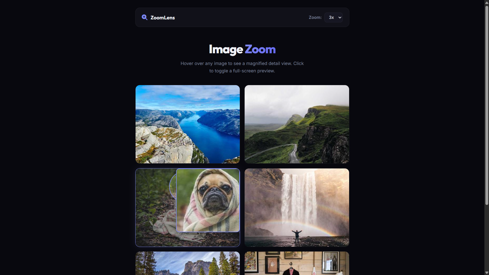

# 035 - Image Zoom Effect

Hover over images to see a magnified detail view through a circular lens. Click any image for a full-screen lightbox preview.

## Preview



## Features

- **Circular zoom lens** follows the cursor over each image
- **Magnified result panel** shows the zoomed area in real-time
- **Adjustable zoom level** — 2x, 3x, or 4x via dropdown
- **High-res loading** — hover loads a larger version for sharp zoom
- **Click-to-lightbox** for full-screen image preview
- **Escape key / backdrop click** to close lightbox
- **Dimmed overlay** outside the lens area for focus
- **Responsive** grid layout

## Structure

```
035 - Image Zoom Effect/
├── index.html
├── css/style.css
├── js/script.js
└── README.md
```

## How to Run

Open `index.html` in any browser. Requires an internet connection for sample images.
