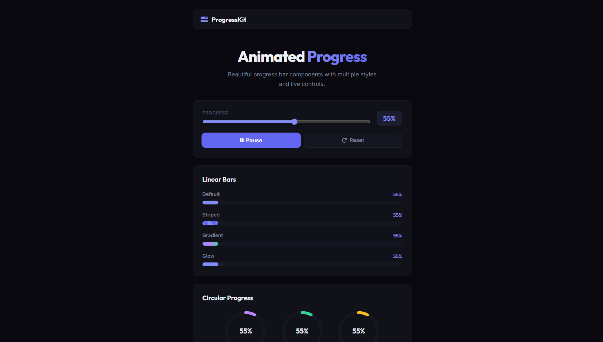

# 036 - Animated Progress Bar

Beautiful animated progress bar components with linear, circular, and step-based styles — all driven by a single slider control.

## Preview



## Features

- **4 linear bar styles** — default, striped (animated), gradient, and glow
- **3 circular SVG progress rings** — purple, green, amber
- **4-step progress tracker** with connecting line fill
- **Range slider** for manual control
- **Animate button** smoothly fills from current value to 100%
- **Pause / reset** controls
- **All components sync** to a single progress value
- **Responsive** layout

## Structure

```
036 - Animated Progress Bar/
├── index.html
├── css/style.css
├── js/script.js
└── README.md
```

## How to Run

Open `index.html` in any browser.
