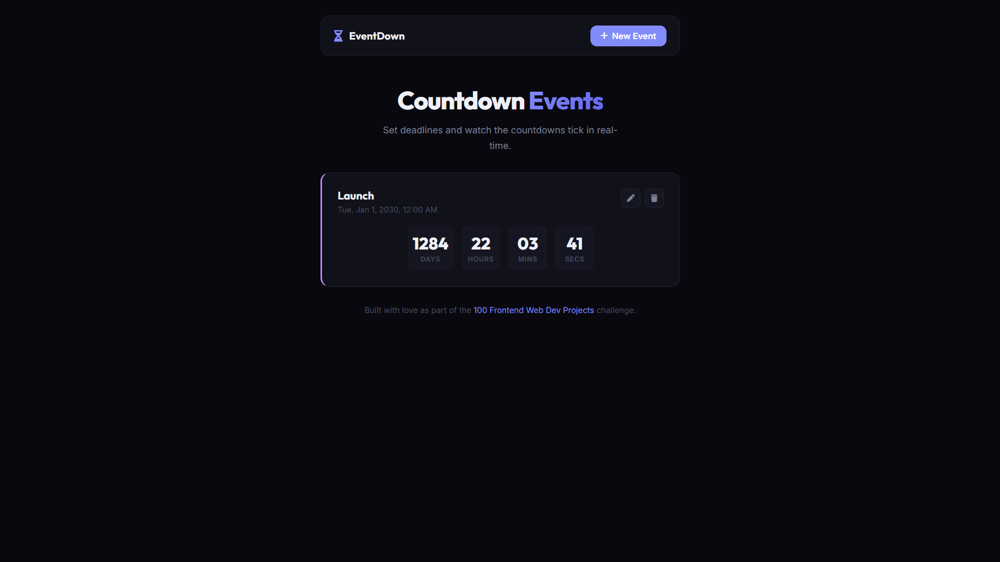

# 037 - Countdown Event App

Set deadlines for events and watch live countdowns tick every second. Create, edit, delete, and color-code events — all persisted in localStorage.

## Preview



## Features

- **Create events** with a name, date/time, and color
- **Live countdown** updating every second (days, hours, minutes, seconds)
- **Edit events** through the same modal form
- **Delete events** with instant removal
- **5 color themes** — purple, blue, green, amber, pink
- **Expired badge** shown when an event's date has passed
- **localStorage persistence** across sessions
- **Sorted by date** — nearest event first
- **Responsive** layout

## Structure

```
037 - Countdown Event App/
├── index.html
├── css/style.css
├── js/script.js
└── README.md
```

## How to Run

Open `index.html` in any browser.
