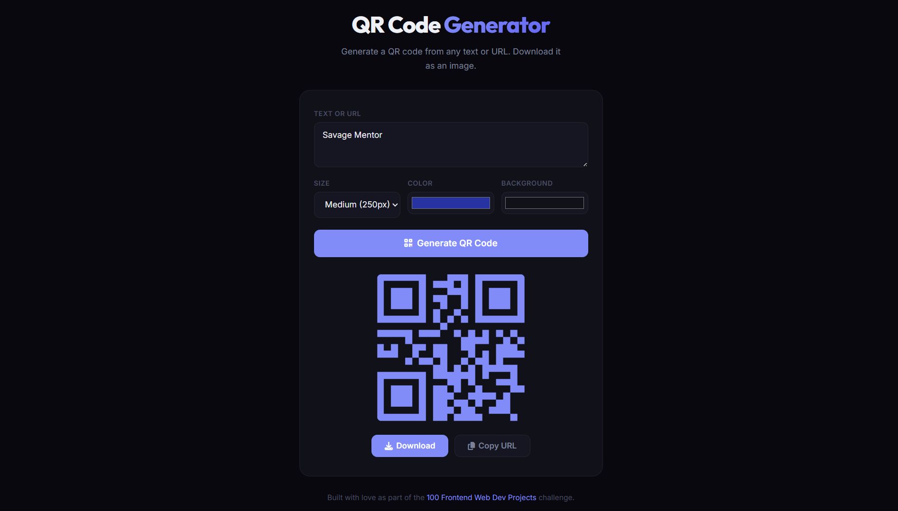

# 038 - QR Code Generator

Generate QR codes from any text or URL with custom colors and sizes. Download or copy the image URL.

## Preview



## Features

- **Generate QR codes** from any text or URL via the goQR.me API
- **3 size options** — Small (150px), Medium (250px), Large (400px)
- **Custom colors** — pick foreground and background colors
- **Download** the QR code as a PNG image
- **Copy URL** to clipboard with visual feedback
- **Enter key** support to generate quickly
- **Responsive** layout

## Structure

```
038 - QR Code Generator/
├── index.html
├── css/style.css
├── js/script.js
└── README.md
```

## How to Run

Open `index.html` in any browser. Requires an internet connection for QR code generation.
