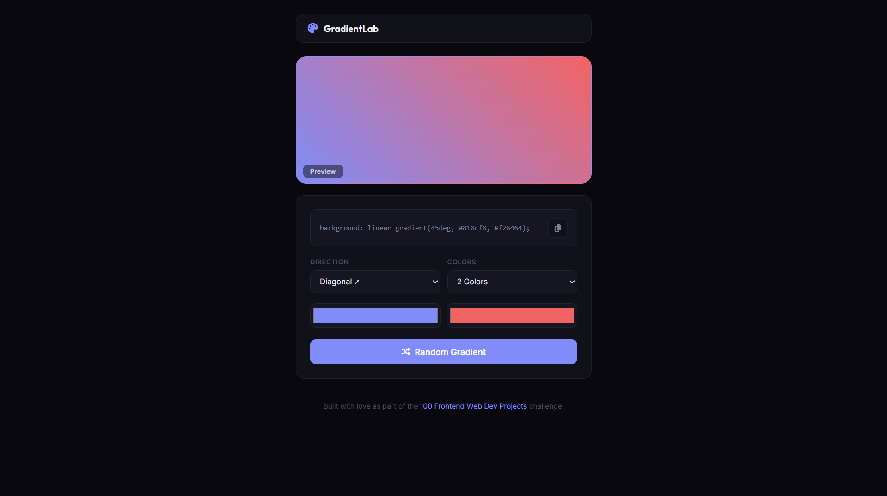

# 040 - Random Gradient Generator

Generate, preview, and save beautiful gradient backgrounds. Copy the CSS with one click.

## Preview



## Features

- **Random gradient generation** with a single click
- **2, 3, or 4 color stops** with color pickers
- **7 direction options** — linear (to right/left/top/bottom, diagonal) and radial
- **Live preview** card that updates instantly
- **One-click CSS copy** to clipboard
- **Save gradients** by double-clicking the preview — persisted in localStorage
- **Load saved gradients** by clicking any saved swatch
- **Delete saved swatches** with hover-reveal close button
- **Responsive** layout

## Structure

```
040 - Random Gradient Generator/
├── index.html
├── css/style.css
├── js/script.js
└── README.md
```

## How to Run

Open `index.html` in any browser.
