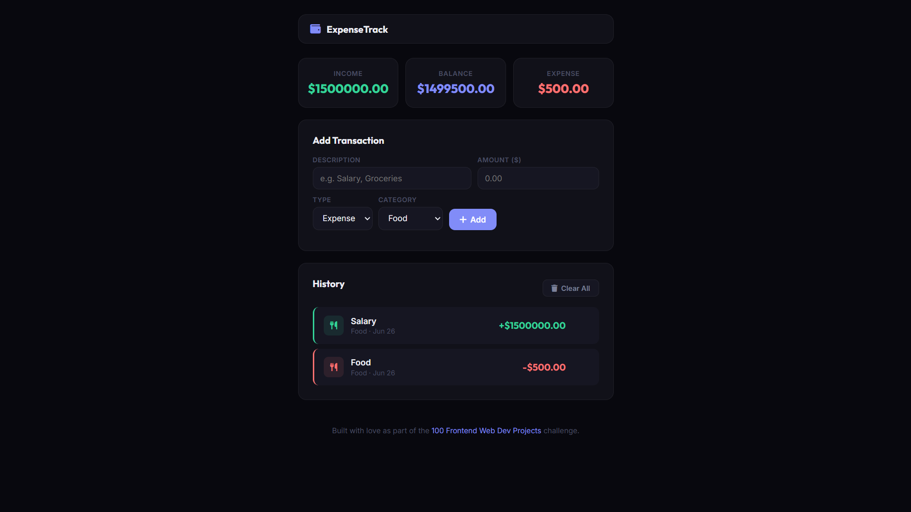

# 041 - Expense Tracker

Add income and expense transactions with auto-totals, category icons, and localStorage persistence.

## Preview



## Features

- **Add income or expenses** with description, amount, type, and category
- **Summary cards** — income, balance, and expense totals update live
- **7 categories** with unique icons — Food, Transport, Shopping, Bills, Salary, Freelance, Other
- **Transaction history** with color-coded borders (green = income, red = expense)
- **Delete individual items** or clear all at once
- **localStorage persistence** across sessions
- **Responsive** layout

## Structure

```
041 - Expense Tracker/
├── index.html
├── css/style.css
├── js/script.js
└── README.md
```

## How to Run

Open `index.html` in any browser.
