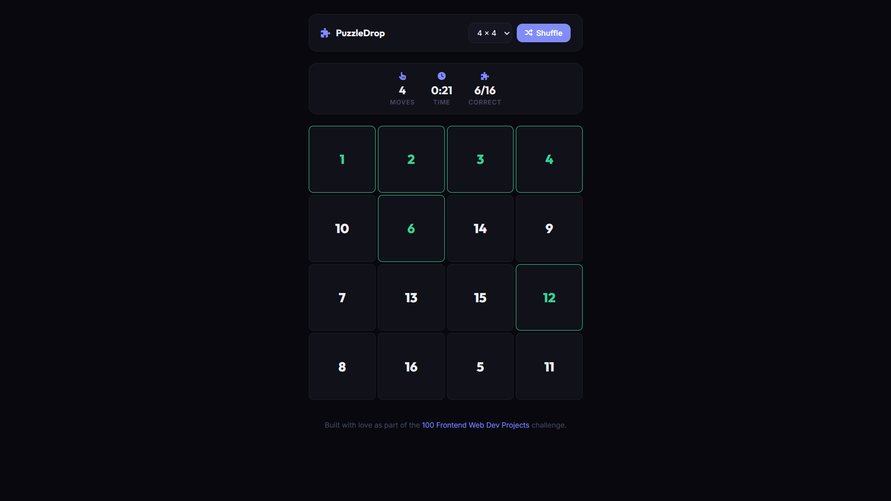

# 042 - Drag & Drop Puzzle

Rearrange numbered tiles by dragging and dropping them into the correct order. Choose between 3×3 and 4×4 grids.

## Preview



## Features

- **Drag and drop** tiles to swap positions using the HTML5 Drag API
- **3×3 or 4×4 grid** selectable from the navbar
- **Move counter and timer** track your performance
- **Correct placement indicator** — tiles in the right spot turn green
- **Win modal** with moves and time summary
- **Shuffle button** to restart any time
- **Responsive** layout

## Structure

```
042 - Drag and Drop Puzzle/
├── index.html
├── css/style.css
├── js/script.js
└── README.md
```

## How to Run

Open `index.html` in any browser.
