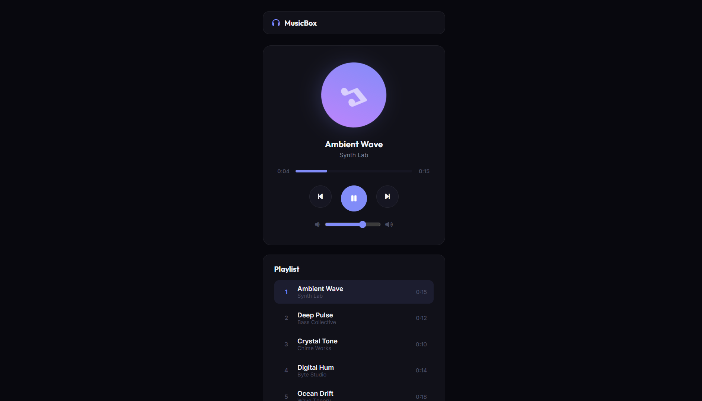

# 043 - Music Player

Play, pause, and skip synthesized tracks with a progress bar, volume control, and playlist.

## Preview



## Features

- **6 demo tracks** synthesized with the Web Audio API — no audio files needed
- **Play / Pause** with spinning album art animation
- **Previous / Next** track navigation
- **Click-to-seek** progress bar with live time display
- **Volume slider** with real-time adjustment
- **Playlist panel** with active track highlighting
- **Auto-advance** to the next track on completion
- **Responsive** layout

## Structure

```
043 - Music Player/
├── index.html
├── css/style.css
├── js/script.js
└── README.md
```

## How to Run

Open `index.html` in any browser.
