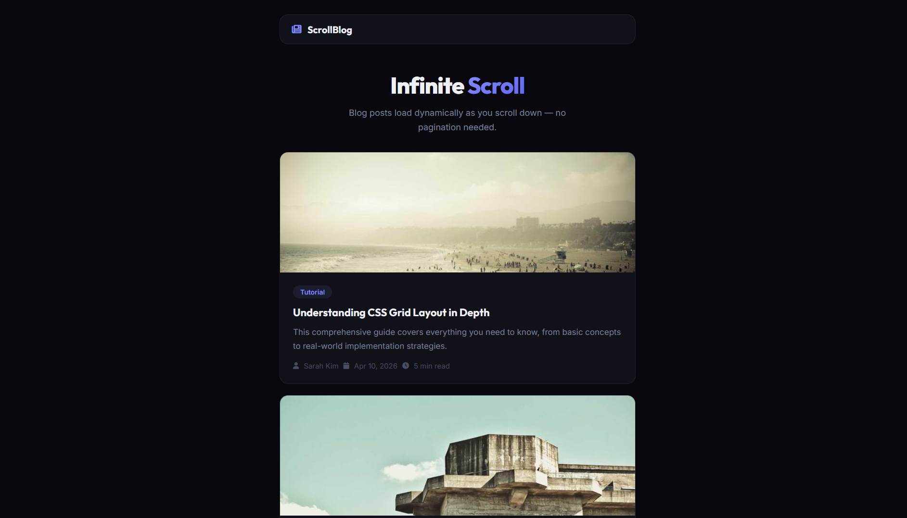

# 045 - Infinite Scroll Blog

Blog posts load dynamically as you scroll down — no pagination buttons needed.

## Preview



## Features

- **Infinite scroll** loads 4 posts at a time as you approach the bottom
- **20 unique blog titles** rotated across pages
- **Random cover images** from Picsum Photos
- **Post metadata** — author, date, read time, and category tag
- **Loading spinner** shown while fetching new posts
- **Fade-up animation** on new posts
- **5 pages maximum** (20 posts total) before the feed ends
- **Responsive** layout

## Structure

```
045 - Infinite Scroll Blog/
├── index.html
├── css/style.css
├── js/script.js
└── README.md
```

## How to Run

Open `index.html` in any browser. Requires an internet connection for images.
