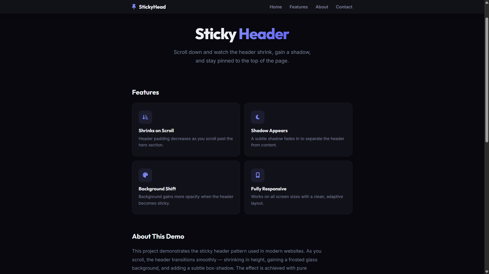

# 046 - Sticky Header Effect

Header stays pinned at the top while scrolling. It shrinks, gains a frosted glass background, and adds a shadow.

## Preview



## Features

- **Fixed header** that stays at the top of the page
- **Shrink effect** — padding reduces on scroll
- **Frosted glass background** with `backdrop-filter: blur`
- **Shadow appears** after scrolling past the threshold
- **Smooth transitions** on all property changes
- **Anchor navigation** with smooth scrolling
- **Passive scroll listener** for optimal performance
- **Responsive** layout

## Structure

```
046 - Sticky Header Effect/
├── index.html
├── css/style.css
├── js/script.js
└── README.md
```

## How to Run

Open `index.html` in any browser.
