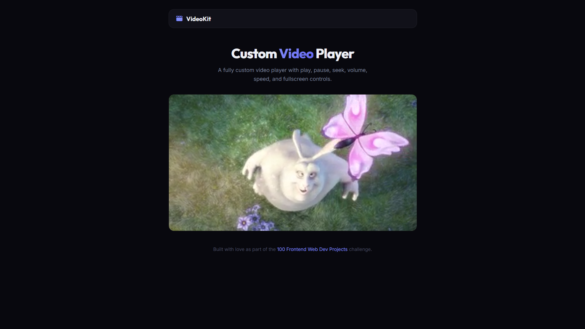

# 047 - Custom Video Player

Fully custom HTML5 video player with play/pause, seek, volume, speed, and fullscreen controls.

## Preview



## Features

- **Custom play/pause** button and big-play overlay
- **Click-to-seek** progress bar with live fill
- **Volume slider** with mute toggle
- **Playback speed** selector (0.5x, 1x, 1.5x, 2x)
- **Fullscreen** toggle
- **Keyboard shortcuts** — Space/K (play), M (mute), F (fullscreen), Arrow keys (±5s)
- **Controls auto-hide** and appear on hover
- **Responsive** layout

## Structure

```
047 - Custom Video Player/
├── index.html
├── css/style.css
├── js/script.js
└── README.md
```

## How to Run

Open `index.html` in any browser.
