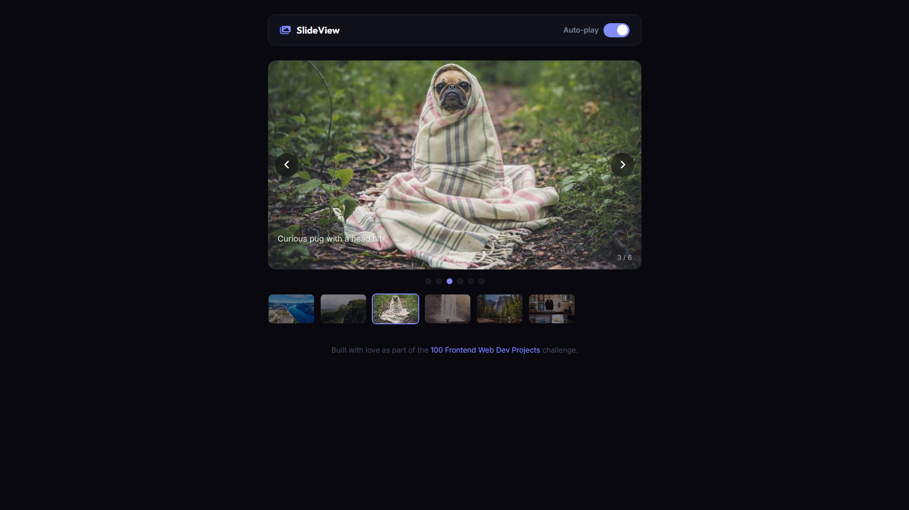

# 049 - Image Slideshow

Auto-rotating hero image slideshow with manual controls, dot indicators, and a thumbnail strip.

## Preview



## Features

- **6 slides** with crossfade transition
- **Auto-play** with 4-second interval and toggle switch
- **Previous / Next** arrow buttons
- **Dot indicators** for direct slide navigation
- **Thumbnail strip** with active highlighting and auto-scroll
- **Slide captions** and counter overlay
- **Keyboard support** — left/right arrow keys
- **Responsive** 16:9 aspect ratio

## Structure

```
049 - Image Slideshow/
├── index.html
├── css/style.css
├── js/script.js
└── README.md
```

## How to Run

Open `index.html` in any browser. Requires an internet connection for images.
