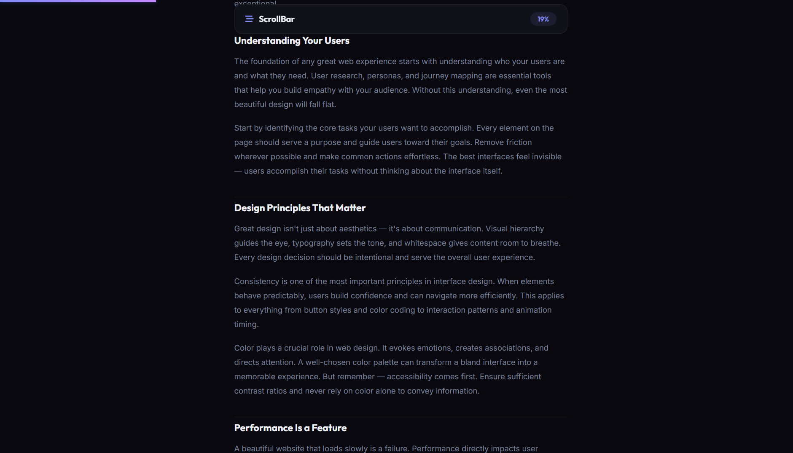

# 050 - Scroll Progress Bar

A gradient progress bar at the top of the page tracks reading progress as you scroll through a long article.

## Preview



## Features

- **Fixed progress bar** at the very top of the viewport
- **Gradient fill** (accent to purple) with glow shadow
- **Percentage badge** in the sticky navbar updates live
- **Sticky navbar** stays visible while scrolling
- **Long-form article** content for meaningful scroll depth
- **Passive scroll listener** for optimal performance
- **Responsive** layout

## Structure

```
050 - Scroll Progress Bar/
├── index.html
├── css/style.css
├── js/script.js
└── README.md
```

## How to Run

Open `index.html` in any browser.
