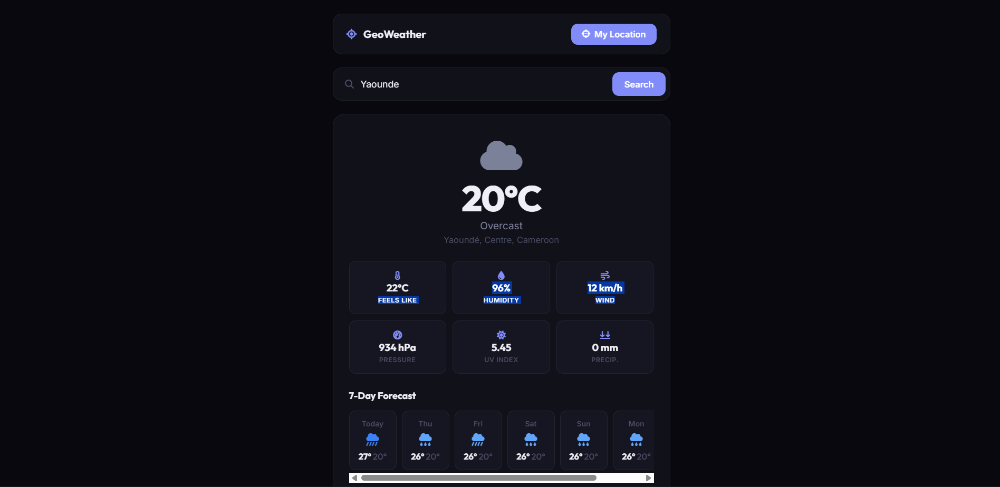

# 051 - Weather + Geolocation

Auto-fetch weather for your actual location using the browser's Geolocation API, with a 7-day forecast.

## Preview



## Features

- **Auto-detect location** using the Geolocation API on page load
- **Reverse geocoding** via OpenStreetMap Nominatim for the city name
- **City search** as a fallback with Open-Meteo geocoding
- **Current conditions** — temperature, feels like, humidity, wind, pressure, precipitation, UV
- **7-day forecast** with daily high/low and weather icons
- **20+ weather codes** mapped to icons and colors
- **Responsive** layout

## Structure

```
051 - Weather Geolocation/
├── index.html
├── css/style.css
├── js/script.js
└── README.md
```

## How to Run

Open `index.html` in any browser. Allow location access when prompted. Requires an internet connection.
