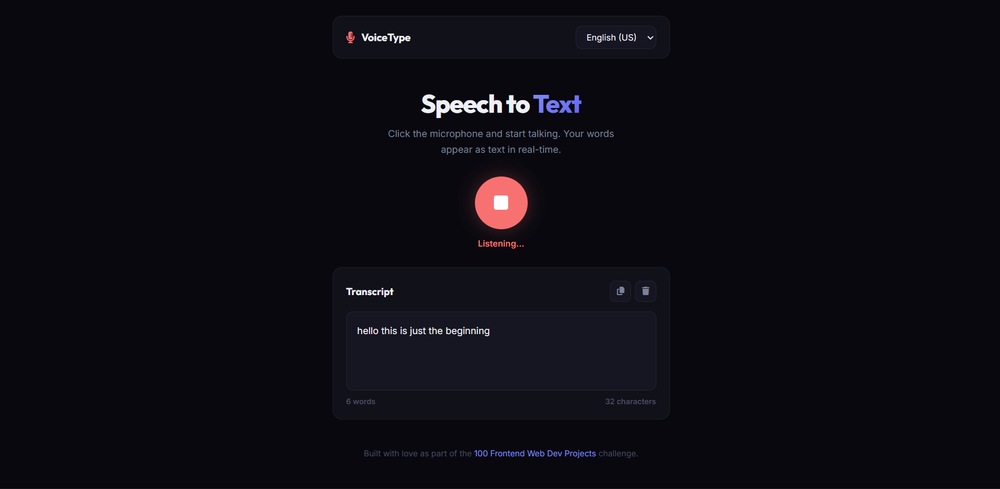

# 052 - Speech to Text App

Convert microphone input to text in real-time using the Web Speech API.

## Preview



## Features

- **Real-time transcription** using the SpeechRecognition API
- **Interim results** shown in italic as you speak
- **8 language options** — English (US/UK), French, Spanish, German, Portuguese, Chinese, Japanese
- **Continuous listening** mode — keeps recording until you stop
- **Pulsing mic animation** while listening
- **Copy to clipboard** and clear transcript buttons
- **Word and character count** updated live
- **Browser support check** with error message for unsupported browsers
- **Responsive** layout

## Structure

```
052 - Speech to Text App/
├── index.html
├── css/style.css
├── js/script.js
└── README.md
```

## How to Run

Open `index.html` in Chrome or Edge (best support for the Web Speech API). Allow microphone access when prompted.
