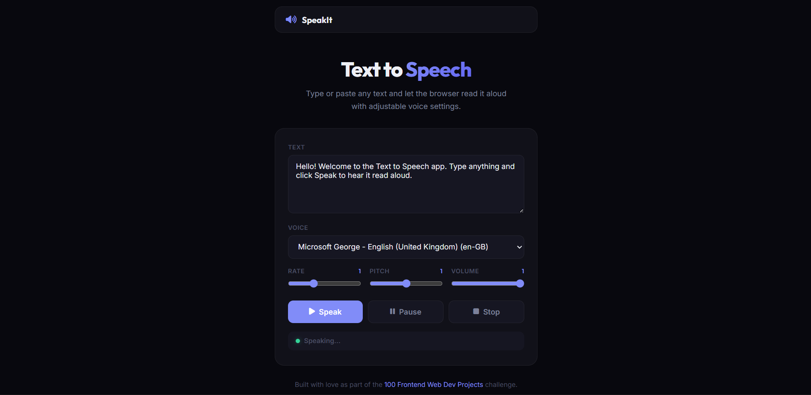

# 053 - Text to Speech App

Type or paste any text and let the browser read it aloud with adjustable voice, rate, pitch, and volume.

## Preview



## Features

- **Browser-native speech synthesis** using the SpeechSynthesis API
- **Voice selector** listing all available system voices
- **Rate slider** (0.5x – 2x) for speech speed
- **Pitch slider** (0 – 2) for voice pitch
- **Volume slider** (0 – 1) for loudness
- **Speak / Pause / Resume / Stop** controls
- **Status indicator** with colored dot (green = speaking, amber = paused)
- **Responsive** layout

## Structure

```
053 - Text to Speech App/
├── index.html
├── css/style.css
├── js/script.js
└── README.md
```

## How to Run

Open `index.html` in any modern browser.
