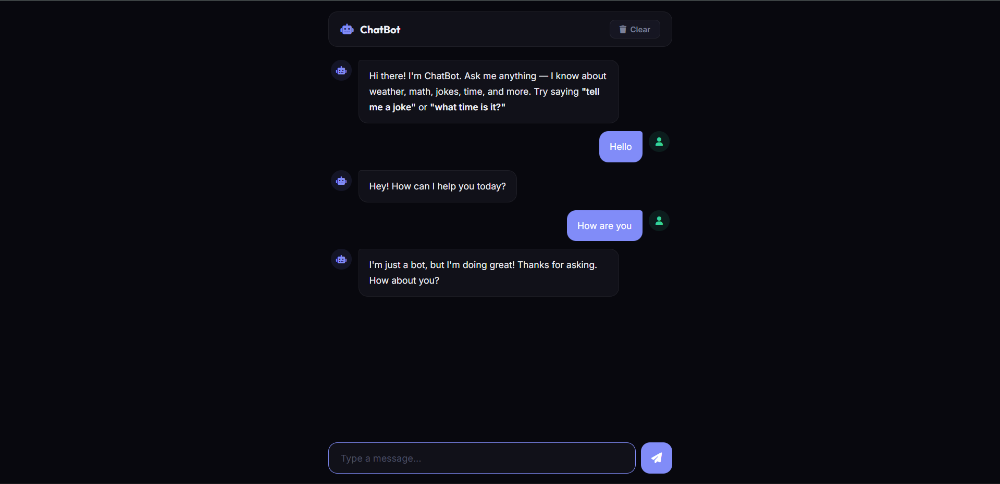

# 054 - Chatbot (Simple AI)

Chat with a JavaScript-powered bot that understands greetings, jokes, math, time, facts, and more.

## Preview



## Features

- **Pattern-matching logic** for greetings, jokes, facts, time, date, math, and farewells
- **Basic math evaluation** — type expressions like "15 * 3" or "100 / 7"
- **8 programmer jokes** and 6 fun facts, served randomly
- **Typing indicator** with animated bouncing dots
- **Chat-style UI** with user/bot avatars and colored bubbles
- **Clear chat** button to reset the conversation
- **Enter key** to send messages
- **Responsive** full-height chat layout

## Structure

```
054 - Chatbot/
├── index.html
├── css/style.css
├── js/script.js
└── README.md
```

## How to Run

Open `index.html` in any browser.
