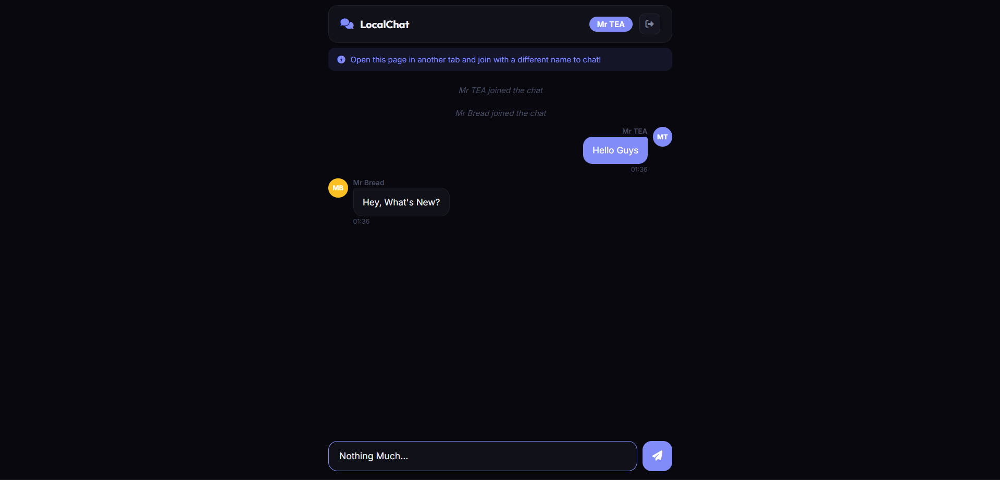

# 055 - Local Chat App

Real-time chat between browser tabs using localStorage events. Open in two tabs, pick different names, and chat!

## Preview



## Features

- **Cross-tab messaging** via the `storage` event — no server needed
- **Login screen** with display name and 6 avatar colors
- **Real-time delivery** — messages appear instantly in other tabs
- **Chat history** persisted in localStorage (up to 100 messages)
- **System messages** for join/leave events
- **User avatars** with initials and chosen color
- **Leave chat** button returns to the login screen
- **Responsive** full-height chat layout

## Structure

```
055 - Local Chat App/
├── index.html
├── css/style.css
├── js/script.js
└── README.md
```

## How to Run

Open `index.html` in two separate browser tabs. Enter a different name in each tab and start chatting.
