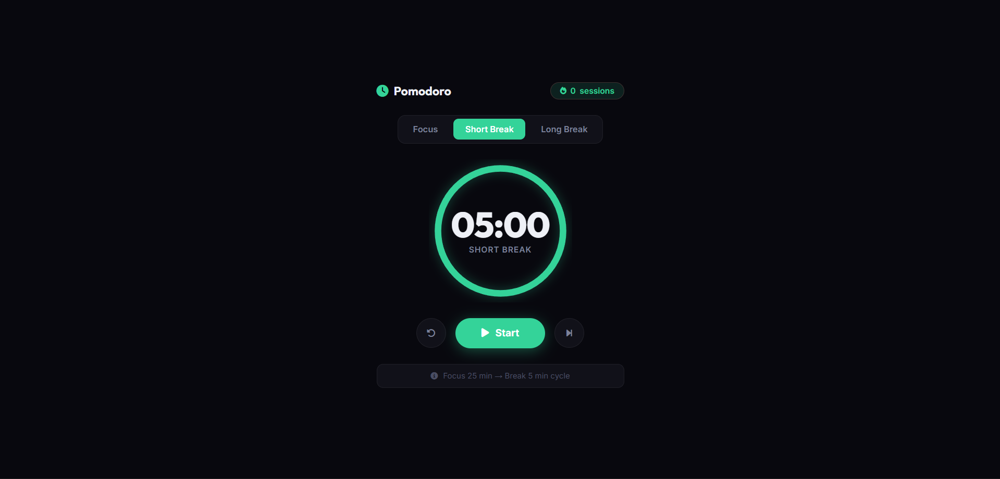

# 056 - Pomodoro Timer

A focus/break cycle timer built on the Pomodoro Technique — 25 minutes of focused work followed by a 5-minute break, with audio alerts and session tracking.

## Preview



## Features

- **Three modes** — Focus (25 min), Short Break (5 min), Long Break (15 min)
- **SVG ring countdown** — animated progress ring that drains as time passes, with a glow pulse while running
- **Start / Pause / Resume** toggle, **Reset**, and **Skip** controls
- **Audio beep** — three-tone chime via Web Audio API when a session ends (no audio files needed)
- **Auto-transition** — switches from Focus → Short Break → Focus automatically on completion
- **Session counter** — tracks completed focus blocks
- **Live tab title** — browser tab updates with the current countdown
- **Color-coded modes** — red for focus, green for short break, blue for long break
- **Toast notifications** on session completion

## Structure

```
056 - Pomodoro Timer/
├── index.html
├── css/style.css
├── js/script.js
└── README.md
```

## How to Run

Open `index.html` in a browser. Select a mode, hit **Start**, and stay focused!
